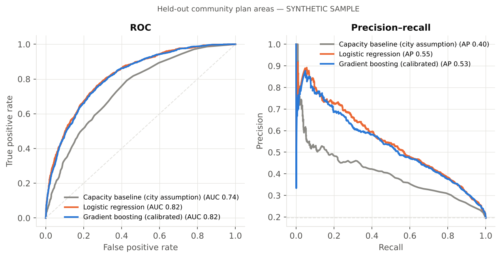
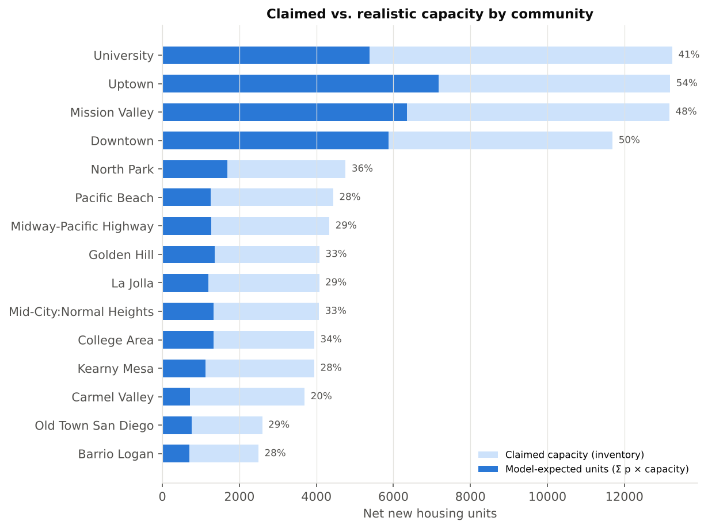
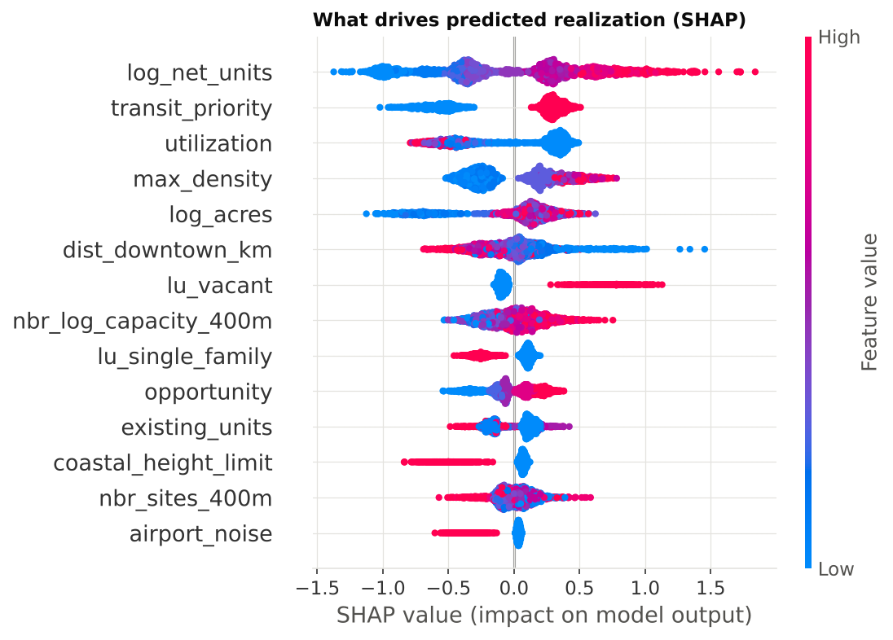
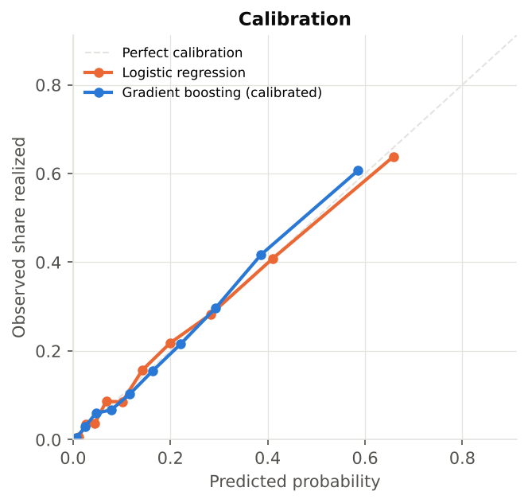
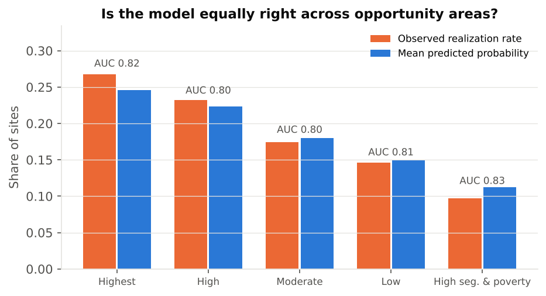

# Will It Get Built? Predicting Which Housing Element Sites Are Realized

**Johan Fernandez** · Urban data science · Spatial machine learning · Housing policy

California cities must show the state that they have enough land zoned to meet
their housing targets. San Diego's 2021–2029 Housing Element lists thousands of
parcels as "adequate sites," each with an estimated unit capacity. But listing
a site does not mean anyone will build on it. If the inventory overstates
realistic capacity, the city can fall short of its target while appearing to
comply on paper.

This project asks:

> **Of the sites San Diego inventoried in 2021, which ones actually received
> housing approvals afterward? And can a spatially validated machine-learning
> model predict that better than the capacity assumptions the inventory relies on?**

The output is a planner tool. It gives each site a calibrated probability of
being realized, a **realistic-capacity estimate** for each community plan area
(Σ probability × capacity), and an equity audit across state opportunity areas.

> ⚠️ **Results below come from the bundled synthetic sample**, which mirrors the
> real data schemas so the pipeline runs offline. They demonstrate the method,
> not findings about San Diego. Run on the real data (two commands, below)
> before citing any number.

---

## Why this design

| Choice | Reason |
|---|---|
| **Features frozen at the 2021 inventory; outcome = approvals afterward** | Using today's parcel values to predict past redevelopment leaks the future into the features. Here the predictors describe each site *as the city inventoried it*. |
| **Leakage-prone columns dropped explicitly** | The live inventory layer contains status and approved-unit fields that are updated over time. They are listed in `config.LEAKAGE_COLUMNS` and a unit test enforces their removal. |
| **Spatial cross-validation by community plan area** | A model must predict neighborhoods it has never seen, which is the planner's real use case. A random K-fold run is reported alongside for comparison. |
| **Policy-relevant baseline** | Models are compared against the inventory's own implicit assumption: more zoned capacity means more likely to be built. |
| **Calibrated probabilities** | Expected units are only meaningful if a probability of 0.3 really means 30%. Isotonic calibration is applied and checked. |
| **Equity audit** | Accuracy and predicted realization are broken out by CTCAC/HCD opportunity area, which ties the work to state fair-housing (AFFH) requirements. |

## Data (public, City of San Diego)

| Dataset | Source | Role |
|---|---|---|
| Housing Element Adequate Sites (2021–2029) | `webmaps.sandiego.gov/.../PLN_Housing_ServiceLayers/MapServer/1` | Unit of analysis and features: acreage, existing and potential units, zoned density, existing use, overlays (coastal, height limit, floodway, MHPA, airport noise), transit priority area, CTCAC opportunity, poverty/RECAP |
| Housing Element Permit Data (DSD approvals) | `.../PLN_Housing_ServiceLayers/MapServer/0` | Outcome: net new dwelling units approved per parcel after June 2021 |
| Development approvals, bulk CSV (optional) | `seshat.datasd.org/development_permits/` | Alternative permit source |

**Outcome definition.** A site is *realized* if at least one net new non-ADU
dwelling unit was approved on it after adoption. Approvals are matched by APN.
Approvals with no APN fall back to a point-in-polygon spatial join. ADU-only
approvals and approvals issued before the window are excluded. All of these
rules are set in `config.py` and covered by tests.

## Methods

1. **Features (28).** Log capacity, lot size, utilization (existing ÷ potential
   units), zoned density, existing-use groups, regulatory overlays, transit
   priority, opportunity category, distance to downtown, and neighborhood
   context (inventory sites and capacity within 400 m, built only from baseline
   attributes).
2. **Models.** Capacity-only baseline, regularized logistic regression, and
   LightGBM with isotonic calibration.
3. **Validation.** 5-fold `GroupKFold` over community plan areas, with
   bootstrap 95% confidence intervals for ROC-AUC and PR-AUC.
4. **Explanation.** SHAP values from the gradient-boosted model.
5. **Planner outputs.** Realistic capacity by community, an equity table, and an
   interactive Leaflet map of site-level probabilities.

## Results (synthetic sample: 6,000 sites, 32 community plan areas, 19.5% realized)

| Model (spatial CV) | ROC-AUC [95% CI] | PR-AUC [95% CI] | Brier |
|---|---|---|---|
| Capacity baseline (inventory assumption) | 0.742 [0.727, 0.756] | 0.399 [0.374, 0.429] | – |
| Logistic regression | **0.821** [0.809, 0.834] | **0.548** [0.519, 0.576] | 0.120 |
| Gradient boosting (calibrated) | 0.817 [0.804, 0.828] | 0.533 [0.503, 0.560] | 0.122 |

Because the sample is synthetic, the true probabilities are known. A perfect
model would reach an ROC-AUC of 0.841, so both learned models recover most of
the available signal.



**Realistic capacity.** Summing calibrated probabilities × capacity turns
124,225 claimed units into about 43,800 expected units (35%). The discount
varies widely by community, from roughly 20% to 54%.



**Drivers.** Capacity, transit priority areas, low current utilization, zoned
density and lot size raise the predicted probability. The coastal height limit
and airport noise overlays lower it.



**Calibration and equity.**




**Interpreting the sample honestly.**
- Logistic regression matches gradient boosting here. That is a legitimate
  result: when the signal is mostly additive, the simpler and more
  interpretable model is the better choice. Whether real data contain enough
  non-linearity to favor the GBM is an open empirical question.
- Spatial and random CV agree on the synthetic data because the generator has
  few neighborhood-specific effects. On real data, a gap between the two would
  measure how much accuracy depends on having seen a neighborhood before.

## Reproduce

```bash
pip install -r requirements.txt
export PYTHONPATH=src            # Windows PowerShell: $env:PYTHONPATH="src"

# Offline demo on synthetic data
python -m hsr.make_sample_data
python run_pipeline.py --data sample

# Real San Diego data (needs internet; public ArcGIS endpoints)
python -m hsr.download
python run_pipeline.py --data real

pytest -q                        # outcome-construction and leakage tests
```

Outputs go to `outputs/<data>/` (metrics, realistic capacity by community,
equity table, SHAP importance, `site_predictions.geojson`, and
`site_realization_map.html`). Figures go to `reports/figures/<data>/`. The
predictions GeoJSON opens directly in ArcGIS Pro or QGIS.

## Limitations and next steps

- **Approval ≠ completion.** Approvals measure intent to build. Certificates of
  occupancy would measure delivered units.
- **Short window.** About four years of an eight-year cycle are observed. A
  survival model (time to approval) would use censoring properly and is the
  natural extension.
- **Market data.** Adding land and improvement values, rents and sales comps
  (as of 2021) would test the economic-feasibility explanation directly.
- **Causal questions.** This model is predictive. Estimating the *effect* of
  policies such as Complete Communities or SB 9 needs a causal design such as
  difference-in-differences.
- **Transferability.** Training on one California city and testing on another
  would show whether a statewide "realistic capacity" check is feasible.

## Repository layout

```
run_pipeline.py            end-to-end study
src/hsr/config.py          sources, study window, leakage list
src/hsr/download.py        paged ArcGIS REST download
src/hsr/make_sample_data.py synthetic data with real schemas
src/hsr/build_dataset.py   outcome construction and feature engineering
src/hsr/models.py          baselines, models, spatial CV, bootstrap CIs
src/hsr/report.py          figures, realistic capacity, equity audit
src/hsr/webmap.py          interactive Leaflet map
tests/                     unit tests
```

## Shared database

The sites and approvals tables are also layers in **[geoai-cities-db](https://github.com/JohanArisato/geoai-cities-db)** (`sd_housing_sites`, `sd_housing_permits`), joined to San Diego's 124 neighborhoods and to CurbCall's resident reports. That makes cross-project questions one query away, for example: do the sites the city counts on for new homes sit in neighborhoods where residents report the most unresolved sidewalk, lighting and flooding problems?

## Part of

[GeoAI for Cities](https://github.com/JohanArisato/geoai-for-cities) · [Who Gets the Shade?](https://github.com/JohanArisato/who-gets-the-shade) · [CurbCall](https://github.com/JohanArisato/curbcall)

## License

MIT. Data © City of San Diego, used under its open-data terms.
